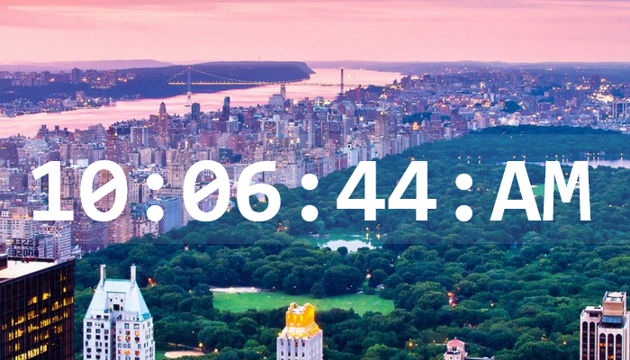

# Digital Clock

To test the program, download the files and run the index

## The project

The clock was created with HTML5, CSS3 and JavaScript  
The main focus of the project is having easy to understand code, good readability and a functional JavaScript digital clock  
Hours, minutes and seconds are counted on AM and PM format
